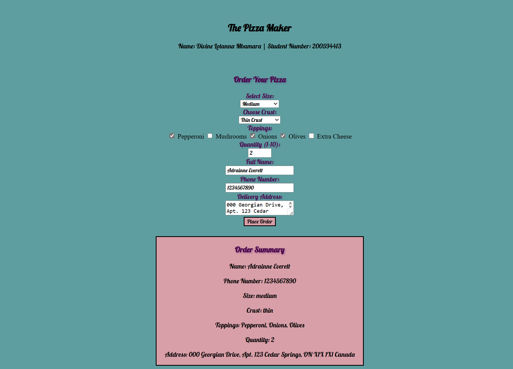

# The Pizza Maker 
### DESCRIPTION 
Build a simple form that allows a user to order a pizza, including a number of ingredients and 
other suitable characteristics. Include an ‘order’ button that creates a Pizza object and 
presents it to the customer.

### LIVE DEMO
You can view the live version of the project here: [Live Demo](https://divine-mbamara.github.io/Assignment3-JavaScript/)

### PROJECT PREVIEW

### INSTRUCTIONS 
1. Create an html file (index.html) and two folders which contain CSS and JavaScript for the 
assignment. 
2. Build a simple HTML form that you think would be appropriate for a customer to order a 
pizza. Dynamically add your student id and name somewhere on the page using a p tag and 
JavaScript. 
3. Be creative – what different options might you want your customers to have?  
4. Validate the HTML pizza order form.  
5. Write a short piece of JavaScript to capture the values from each of the form inputs, when the 
user clicks the ‘order’ button.  
6. Create a class for the Pizza object, using the parameters from the order form you just created.  
7. Visually output a description of the customer’s pizza to the HTML page. 
8. The JavaScript and CSS file should be linked to the html. Don’t forget to use defer if you are 
adding script in the head section. 
9. Once you’ve completed the functionality of the interface, add some CSS to make the page 
visually attractive (don’t spend too much time on this – the focus is the JS). 
